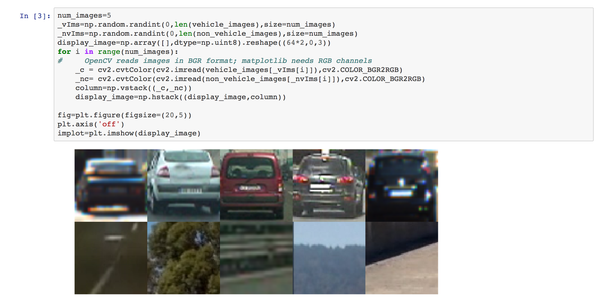
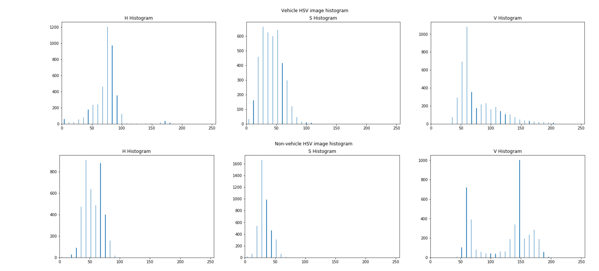
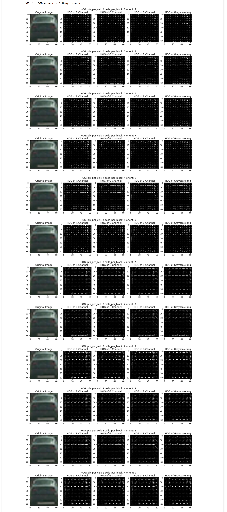
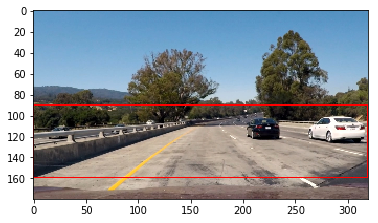
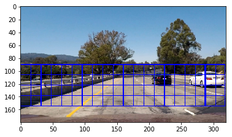
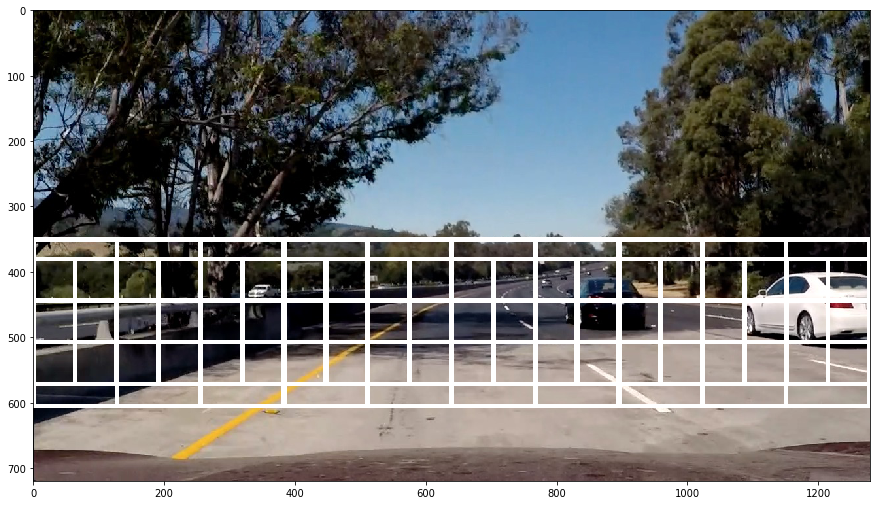
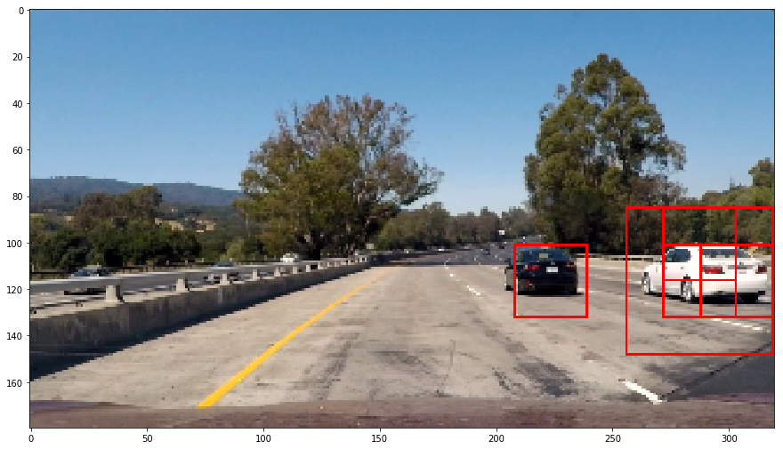
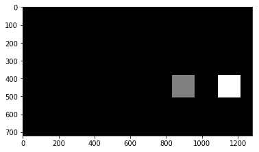

# Vehicle Detection Project
Project on vehicle detection in real road images. A machine learning model is trained with vehicle images and is used to detect the parts of the camera image containing cars using sliding window technique. 

__Key lessons learnt__:
- Feature extraction
- HOG features
- Sliding window technique
- SVM and classification
- Video frames handling and tracking


__Files in the submission__:
- Preprocessing.html - All the preprocessing steps for images
- Feature_Extraction(*)./html - Attempts at extracting features 
- Sliding_window.html - Trying different things with sliding window size adjustments
- Submission_notebook.html - Final ipython notebook


### Feature Extraction and Machine Learning Models
Following steps are performed for feature extractions
#### Preprocessing
Images are read from the source files and visualized. One important thing to noticed here is that - most images belong to rear view of the car (_this is has some effect on detection, as discussed in last section_) Once images are read, I tried changing colorspaces and plot the histogram of colors to see how vehicle and non-vehicle classes deferred. I tried RGB, YCrCb, HSV and HSL colorspaces with 16, 32 and 64 bin sizes. HSV and HLS colorspaces with 32 bins were choosen as they looked promising.

Below is the sample image showing vehicle and non-vehicle data:



Example of HSV histogram for vehicle and non-vehicle data:



#### Histogram of Oriented Gradients (HOG)
This was done as a part of [preprocessing][ppr] and [feature selection][fsel1] steps. I tried following options:
- pix_per_cell: [4,8]
- cell_per_block: [2,4]
- orient: [7,8,9]
- Image size: (32x32), (64x64)
- Color spaces: Gray, RGB (individual channels), HSV (individual channels)

Based on different tests, I could make following observations:
- Using (32x32) image size helped reduce the feature vector size. Using (64x64) images gave better accuracy.
- 9 orientations gave better results than 7 or 8 orientations
- cell_per_block=2,pix_per_cell=4,orient=8, img_resize=(32,32) for HOG feature on grayscale images with 16 bin histogram of RGB channels gave a 99.07%/98.98% train/test accuracy. But was very poor on actual road images. This was a clear call to use different feature vectors
- cell_per_block=2,pix_per_cell=8,orient=9, img_resize=(64,64) for HOG features and 32 bin histogram for HSV colorspaces gave a fair performance of 98.93% accuracy on test set, but could detect cars on actual road images fairly well.

Below image shows the HOG image for vehicle data for R, G, B channels and Gray image



Following the some hints from the reviewers suggestions, I tried using Linear Kernel to improve the speed of detection.


#### Machine Learning Models
This process is done togather with previous step. I tried Random Forests (RF) and Support Vector Machines (SVM) on the HOG+Color features and conducted a grid search to evaluate their performance.


__SVM Classifier__
I tried following parameters for SVM clasifier:
- kernel: 'linear', 'rbf'
- C: [1, 10, 100, 1000]
- gamma: [0.1, 0.001,0.0001]

Top performing results:

| Rank | kernel | gamma | C | Validation Accuracy | 
| --- | --- | --- | --- | --- |
| 1 | rbf | 0.001 | 10 | 0.993 |
| 2 | rbf | 0.001 | 100 | 0.993 |
| 3 | rbf | 0.001 | 1000 | 0.993 |

Clearly 'rbf' kernel with 0.001 gamma performs well. I double checked the accuracy numbers to be sliglty different in 4th or 5ht precision nummbers. 

__Random Forest Classifier__
I tried RF classifier cross validation with following parameters:
- max_depth": [3, None]
- max_features: [1, 3, 10]
- min_samples_split: [1, 3, 10]
- min_samples_leaf: [1, 3, 10]
- bootstrap: [True, False]
- criterion": ["gini", "entropy"]

Best performing RF classifiers gave a good accuracy of ~99% on validation set, but were not effective on real road images sliding window search. 


### Sliding Window Search

Sliding window technique is used to detect the cars in the video frame. Each video frame is divided into number of windows and these windows are used to test using the trained machine learning model. We can use multiple size window to detect the cars which appear to be of different size depending on their position in the image.

Instead of using whole of image, we can define the region of interest, where we generally see the cars. We can also try to reduce the size of imagea and try to use sliding windows. This is done by trial and error on the given dataset. One such attempt is depicted below:



The red border shows the area used for sliding window. Image below shows how we can fit a sliding window in region of interest:



When deciding on multiple scales for window size, we can use some clever techniques of adjusting the position of the window sizes. Use larger window sizes in whole ROI and smaller window sizes near the horizon lines. Below images shows such arrangement for just two window sizes:



I used a 50% overlap of windows to achieve a good result. Increasing the overlap resulted in multiple detections and did not improve the overall performance.

__Multiple Detections__

Using multiple window sizes might result in multiple detection of same car. Since we have a 50% overlap, it's possible that the algorithm detects in multiple scales as well as multiple window positions. Below shows one such example:



I used the technique mentioned in the lecture to handle this case. Using heat map based threshold to detect the center of the car and draw a boundary around it. This performed well and below pic represents one result:




### Video Implementation

Video implementation was just similar to all the steps mentioned above, but with a few differences. Video makes it easier to handle false positives and track based on previous frame information.

__False Positives__

Our classifier sometime misclassifies the non-vehicle window portions as the vehicle images. This results in a false positives. These can be handled if we know the previous frame information. I fixed this issue using a very simple technique shown below:

```python
from collections import deque
from functools import reduce
# have a dqueue of last 5 frames
heatmaps=deque(maxlen=5)

def process_video(frame):
    bbox_list=get_bboxlist(frame)
    heatmaps.append(add_heat(np.zeros_like(frame[:,:,0]).astype(np.float),bbox_list))
    # detect as a car only if it appears in 2 or more frames
    heatmap = apply_threshold(reduce(lambda x,y: x + y, heatmaps), 2)
    labels = label(heatmap)
    plt.imshow(labels[0], cmap='gray')
    return draw_labeled_bboxes(frame, labels)
```

I create a fixed length queue using `dqueue` and apply a threashold. This makes sure that only when n or more consecutive frames detect a car, that window is classified as car. Using thresholds based on `decision_function` method of `LinearSVC`, I got better resutls (as in second video below and in [here][subm2])

Here is the [Old video link](https://www.youtube.com/watch?v=Z32THrnDAdY)
New Video link:

[](https://www.youtube.com/watch?v=Fo5VonIuyW0)


---

### Deep Learning Based Vehicle Detection

While the models above performed fairly well, they needed a lot of manual finetuning and parameter adjustments to work on the video data. Increasing the number of sliding windows improved the result with significant increase in processing time. This led me to look for deep learning based approaches. 

We can either use transfer learning to get the features and use sliding window technique to detect cars in the image or go for some advanced approaches. [Single Shot Multibox Detector (SSD)](https://arxiv.org/abs/1512.02325) and [You Only Look Once (YOLO): Real Time Object Detection](https://pjreddie.com/darknet/yolo/) have been very popular approaches in the literature recently and propose a significant improvement. I wanted to try their performance on the video data to see the difference. YOLO is based on __darknet__ and need some work around to get the pipeline running, whereas SSD had a port for keras and was easy to try out on the test data.

SSD uses a single shot feed forward convolutional neural network architecture for detecting the objects and bounding boxes. Initial few layers are borrowed from standard classification networks like VGG-16 (fully connected layers truncated). Later layers are used for multi-scale feature map for detection and estimating the bounding boxes. The model uses weighted sum of smooth L1 localization loss and softmax confidance for loss function. Figure below shows the architecture:


I used [ssd-keras](https://github.com/rykov8/ssd_keras) framework and SSD300 architecture for testing. Using the pretrained network weights and resizing image to 300x300, I could get upto **53fps** on test video. This was run on a Titan X GPU and i7 processor. ([Submission File][ssd])

SSD Based Vehicle Detection Video:

[](https://www.youtube.com/watch?v=piUwasFJ15M)


### Discussion

#### 1. Feature Vectors

SVM based approach relied heavily on how the feature vector was engineered. I saw a clear difference between using HOG on gray image and All channels in YUV colorspace. This asserts the fact that, it takes a lot of engineering effort to fine tune these parameters and it is hard to generalize the results.

Whereas, using SSD network architecture, network had learn to extract better features from the images and performed consistently better than previous results. This was very promising.


#### <a name="back_view"></a> 2. Back view problem

As alluded before, most of the images in the dataset contain the backside view of the car. We do see left and right portions of the car in our camera frames. If we can train the machine learning model with side view of the cars, I hope we can get much better results.

#### 3. Real Time Performance

Using SVM based approaches, my result closely related with type of features I use and size of windows I search. When I increased feature size to ~1400 and I used 64, 96, 128 and 200 pixel size windows cleverly, I got farily good results. This did come at a cost of processing time. A 50 seconds video took almost 7 minutes to process. Whereas, on the SSD test case, I could get upto **53 fps** and was very fast with GPUs. This tells us that, using GPUs and parallizing searching in windows, we can make the real time detections. 

[//]: # (References)
[fsel1]: ./Feature_Selection.html
[fsel2]: ./Feature_Selection_trial2.html
[fsel3]: ./Feature_Selection_trial3.html
[ssd]: ./SSD_Vehicle_Detection.html
[ppr]: ./Preproceessing.html
[swin]: ./Sliding_Window.html
[subm]: ./Submission_Notebook.html
[subm2]: ./Submissoin_Notebook_ver2.html
